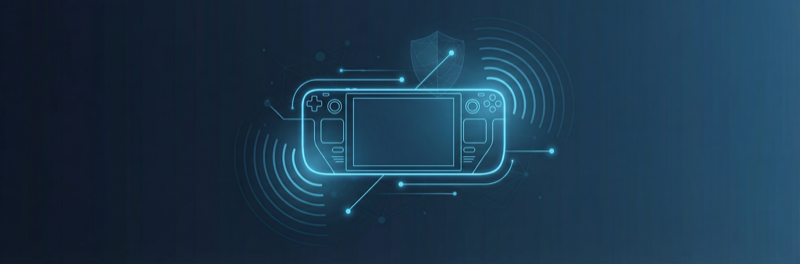

# Xray Decky — VPN & Proxy Client for Steam Deck

**English** · [Русский](README.ru.md) · [中文](README.zh-CN.md) · [فارسی](README.fa.md) · [Español](README.es.md)



Run a VPN on your Steam Deck — including Gaming Mode. Xray Decky is a
[Decky Loader](https://wiki.deckbrew.xyz/) plugin: a full-featured
proxy client (VLESS/VMess/Trojan/Shadowsocks/SOCKS5/Hysteria2/TUIC)
whose TUN mode routes **all** system traffic through an encrypted tunnel —
system-wide, VPN-style coverage where games can't ignore it. Multi-server
subscriptions, a Steam-styled web admin panel, kill switch and live
traffic stats included.

## Features

- **Broad protocol & transport coverage** — imports **VLESS** (REALITY /
  XTLS-Vision), **VMess**, **Trojan** and **Shadowsocks** (incl. 2022 ciphers)
  over RAW/TCP, WebSocket, gRPC, HTTPUpgrade, XHTTP and mKCP, with full TLS /
  REALITY / uTLS-fingerprint parameters. **Hysteria2** and **TUIC** run on the
  sing-box core, downloaded on demand. Your own **SOCKS5** proxy
  (`socks://[user:pass@]host:port`) works too — no subscription needed.
- **Multi-server profiles & subscriptions** — store many servers; import a
  subscription URL (base64 or plain-text link lists) and refresh it in place.
  Manually-added servers are preserved across refreshes, and the provider's
  data quota / expiry (`Subscription-Userinfo`) is shown when available.
- **Latency testing** — TCPing all servers, with color-coded per-server results
  in both the QAM picker and the web panel.
- **Live traffic stats** — download / upload speed and session totals in the
  QAM, plus a real-time speed graph in the web panel.
- **Web Admin Panel** — Steam-styled management UI on your phone/PC (QR pairing
  from the QAM): live status + speed graph, server list, subscription info,
  import, TUN / kill-switch toggles, and a core update checker. Guarded by a
  random per-install token with failed-auth rate limiting.
- **Quick Access Menu** — connect toggle, server picker, live status/speed,
  TUN + kill-switch, and an admin-panel QR code.
- **English / Russian** — both the QAM and the web panel are localized
  (auto-detected from the Steam / browser locale).
- **Connection Toggle** — turn proxy on/off from Quick Access.
- **TUN Mode** — system-wide VPN-style routing through a virtual network
  interface, **recommended for Gaming Mode**.
- **Kill Switch** — block traffic when the proxy disconnects (optional).
- **Resilient** — a crashed xray-core is detected instantly and restarted with
  backoff; TUN routes are re-applied after sleep/resume; the pinned core
  self-heals if the immutable filesystem wipes the bundled binary.

**Network recovery:** if the Deck ever loses connectivity because the plugin
died uncleanly, run `sudo bash recover.sh` (shipped in the plugin folder,
also at [defaults/recover.sh](defaults/recover.sh)) from a Desktop Mode
terminal — it removes the kill-switch firewall chain, stale TUN routes and
the system proxy.

## Installation

**Prerequisites:** Steam Deck with [Decky Loader](https://wiki.deckbrew.xyz/) installed.

- **Desktop Mode (one-click, recommended):** Download [Install-Xray-Decky.desktop](https://raw.githubusercontent.com/VadimOnix/xray-decky/master/scripts/Install-Xray-Decky.desktop), set executable (Properties → Permissions), double-click to run. See [scripts/README.md](scripts/README.md).
- **Konsole (install script):** `curl -sSL https://raw.githubusercontent.com/VadimOnix/xray-decky/master/scripts/install-xray-decky.sh | bash`
- **Archive (zip):** Download [latest release](https://github.com/VadimOnix/xray-decky/releases/latest) zip → Decky Loader → Settings → Developer → Install Plugin from URL → paste zip URL.

The plugin is not published in the Decky Plugin Store — install it with the script or the release zip above.

**TUN mode (recommended):** In Gaming Mode, Steam does not respect system SOCKS proxy settings — games and most system services ignore it. TUN mode creates a virtual network interface that routes **all** system traffic through the proxy, making it the only reliable way to proxy traffic in Gaming Mode. Enable TUN in the plugin settings; no extra setup is required.

Without TUN, the plugin falls back to SOCKS proxy mode, which works in Desktop Mode but may not cover games and system services in Gaming Mode.

**Usage, troubleshooting, more:** [GitHub Pages docs](https://vadimonix.github.io/xray-decky/).

## Development

### Prerequisites

- Node.js v16.14+
- pnpm v9 (mandatory)
- Python 3.x
- xray-core binary

### Setup

```bash
pnpm install
pnpm run build
# Backend: pip install -r requirements-dev.txt
# xray-core: place in bin/xray-core
```

Tests and linters (no device needed): `pnpm test`, `pnpm run lint`,
`pytest tests/`, `ruff check py_modules/ tests/ main.py conftest.py`.
See [Tests and linters](CONTRIBUTING.md#tests-and-linters).

### Project Structure

```
├── src/                      # Frontend TypeScript/React
├── py_modules/backend/src/   # Backend Python, xray-core/sing-box managers
├── defaults/static/          # Embedded web admin panel (ships to plugin root)
├── defaults/recover.sh       # Network recovery script (ships to plugin root)
├── tests/                    # Python test suite (pytest)
├── tests/frontend/           # Frontend test suite (vitest: src/ + admin panel)
├── bin/                      # Local dev core binaries (xray-core, sing-box)
├── site/                     # GitHub Pages site (Astro, 5 locales)
├── main.py                   # Backend entry point
├── plugin.json
└── package.json
```

See [docs/DEVELOPMENT.md](docs/DEVELOPMENT.md) and [docs/RELEASING.md](docs/RELEASING.md) for more.

## Support the project

Xray Decky is free and open source, developed in spare time. If it saved your
gaming session, a crypto donation keeps it going.

| Asset | Network | Address |
| --- | --- | --- |
| GRAM | TON | `UQC_UNDyKIbeAy7qhTG8b6lFIJL3eyYwZit6pxQRtZZ6Dzo6` |
| USDT | TON | `UQC_UNDyKIbeAy7qhTG8b6lFIJL3eyYwZit6pxQRtZZ6Dzo6` |
| USDT | Tron (TRC-20) | `TZ3K36oh6FbpMvxncBwxqPzTC6NnHYQ1pL` |
| ETH | Ethereum (ERC-20) | `0x5F3FbC45A723c92a4797D98ECeE991f2a7b6eec6` |
| SOL | Solana | `ACpEC9m3MuacKL4wwEnfTKGCNNDHuvaKdPLD7DuFvvvB` |
| BTC | Bitcoin | `bc1q9zx6y445lqryl60z3phfekqajyjs45meex4cd4` |

## License

MIT — see LICENSE.

## Resources

- [Decky Loader](https://wiki.deckbrew.xyz/)
- [xray-core](https://xtls.github.io/)
- [Plugin spec](./specs/001-xray-vless-decky/spec.md)
